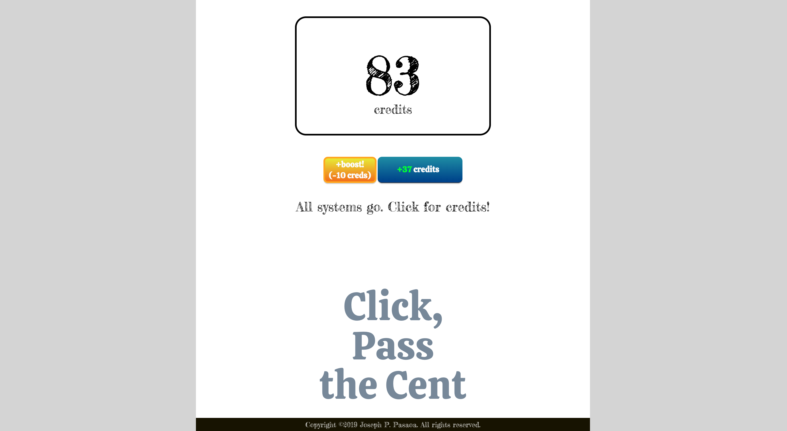

# Click, Pass the Cent! (a React clicker game)

Click, Pass the Cent is an addictive clicker game built with the React framework. The user has two buttons to interact with, the primary points increment button and a secondary augment which increases the value of the primary button's clicks at the cost of ten owned points. The intended goal of the game is to try to go over 100 with the highest score and in the fastest time. Future features include a scoreboard, random obstacles, and more feedback.



## Developer: [**Joseph P. Pasaoa**](https://github.com/joseph-p-pasaoa)

## Technologies Used
+ React 16.12.0
+ Node.js 12
+ JavaScript ES5+
+ HTML5
+ CSS3

## Setup

+ To run **CLICK, PASS THE CENT** locally, install the React app locally using npm:
  ```
  $ npm install
  $ npm start
  ```
+ The app will be found in your browser at [http://localhost:11234/](http://localhost:11234/)

## Features

- Displays the current score to the user
- Clicking the primary button increments the user's score by one initially
- Clicking a secondary button the user can spend 10 collected points to increase the value of each primary button's click by +1
- A warning is displayed if the user clicks the augment button but doesn't have enough points to spend
- When the user earns at least 100 points, the game is ended and the victory screen is shown
- The game can be played again by pressing the new reset button

